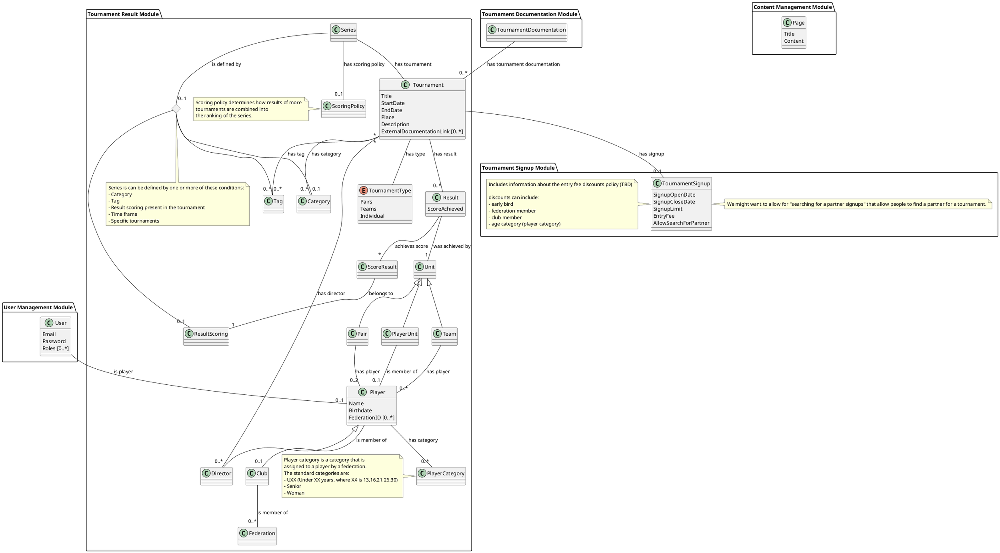

```plantuml
@startuml
top to bottom direction

package "Tournament Result Module" {


class Tournament {
    Title
    StartDate
    EndDate
    Place
    Description
    ExternalDocumentationLink [0..*]
}

enum TournamentType {
    Pairs
    Teams
    Individual
}

Tournament -- TournamentType : has type

class Category {}
class Tag {}

Tournament "*" -- "0..*" Category : has category
Tournament "*" -- "0..*" Tag : has tag

class Result {
    ScoreAchieved
}

Tournament -- "0..*" Result : has result
Result -- "1" Unit : was achieved by

class ScoreResult
class ResultScoring

Result -- "*" ScoreResult : achieves score
ScoreResult -- "1" ResultScoring : belongs to

class Series {}


Series -- Tournament : has tournament

<> series_definition

note bottom of series_definition
Series is can be defined by one or more of these conditions:
- Category
- Tag
- Result scoring present in the tournament
- Time frame
- Specific tournaments
end note


Series -- "0..1" series_definition : is defined by 
series_definition -- "0..*" Tag 
series_definition -- "0..1" Category
series_definition -- "0..1" ResultScoring

class ScoringPolicy

note left of ScoringPolicy
    Scoring policy determines how results of more 
    tournaments are combined into
    the ranking of the series.
end note

Series -- "0..1" ScoringPolicy : has scoring policy

class Unit
class PlayerUnit extends Unit
class Team extends Unit
class Pair extends Unit

Pair -- "0..2" Player : has player
Team -- "0..*" Player : has player
PlayerUnit -- "0..1" Player : is member of

class Player {
    Name
    Birthdate
    FederationID [0..*]
}

class PlayerCategory 

Player -- "0..*" PlayerCategory : has category

note left of PlayerCategory
    Player category is a category that is 
    assigned to a player by a federation.
    The standard categories are:
    - UXX (Under XX years, where XX is 13,16,21,26,30)
    - Senior
    - Woman
end note

class Director extends Player

Tournament -- "0..*" Director : has director


class Federation
class Club

Club -- "0..*" Federation : is member of
Player -- "0..1" Club : is member of

}

package "User Management Module" {

class User {
    Email
    Password
    Roles [0..*]
}

User -- "0..1" Player : is player

}

package "Tournament Signup Module" {


    class TournamentSignup {
        SignupOpenDate
        SignupCloseDate
        SignupLimit
        EntryFee
        AllowSearchForPartner
    }

    note left of TournamentSignup
        Includes information about the entry fee discounts policy (TBD)

        discounts can include:
        - early bird
        - federation member
        - club member
        - age category (player category)
    end note

    note right of TournamentSignup
        We might want to allow for "searching for a partner signups" that allow people to find a partner for a tournament.
    end note

    Tournament -- "0..1" TournamentSignup : has signup
}

package "Tournament Documentation Module" {

    class TournamentDocumentation 
    
    TournamentDocumentation -- "0..*" Tournament : has tournament documentation


}

package "Content Management Module" {

    class Page {
        Title
        Content
    }

}

@enduml
```