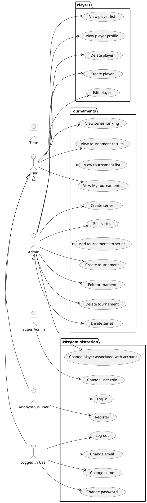

```plantuml
@startuml


actor Time
actor User
actor "Logged In User" as LoggedUser
actor "Anonymous User" as AnonymousUser
actor Admin
actor "Super Admin" as SuperAdmin

User  <|-   LoggedUser
User  <|-   AnonymousUser

Admin  <|-  SuperAdmin
User  <|-  Admin

left to right direction


package "Tournaments" {

' Tournaments 

'' User

usecase "View tournament results" as ViewTournamentResults
usecase "View tournament list" as ViewTournamentList
usecase "View My tournaments" as ViewMyTournaments

User --> ViewTournamentResults
User --> ViewTournamentList
User --> ViewMyTournaments

'' Admin

usecase "Create tournament" as CreateTournament
usecase "Edit tournament" as EditTournament
usecase "Delete tournament" as DeleteTournament

Admin --> CreateTournament
Admin --> EditTournament
Admin --> DeleteTournament

' Series

'' User
usecase "View series ranking" as ViewRanking

User --> ViewRanking

'' Admin
usecase "Create series" as CreateSeries
usecase "Edit series" as EditSeries
usecase "Add tournaments to series" as AddTournamentsToSeries
usecase "Delete series" as DeleteSeries

Admin --> CreateSeries
Admin --> EditSeries
Admin --> AddTournamentsToSeries
Admin --> DeleteSeries

}

package "Players" {

' Players
'' User
usecase "View player list" as ViewPlayerList
usecase "View player profile" as ViewPlayerProfile

User --> ViewPlayerList
User --> ViewPlayerProfile

'' Admin

usecase "Create player" as CreatePlayer
usecase "Edit player" as EditPlayer
usecase "Delete player" as DeletePlayer

Admin --> CreatePlayer
Admin --> EditPlayer
Admin --> DeletePlayer

}

' User authentication

package UserAdministration {

usecase "Log out" as Logout
usecase "Log in" as Login
usecase "Register" as Register

LoggedUser --> Logout
AnonymousUser --> Login
AnonymousUser --> Register

usecase "Change password" as ChangePassword
usecase "Change email" as ChangeEmail
usecase "Change name" as ChangeName

LoggedUser --> ChangePassword
LoggedUser --> ChangeEmail
LoggedUser --> ChangeName

usecase "Change player associated with account" as ChangePlayer
usecase "Change user role" as ChangeUserRole

Admin --> ChangePlayer
SuperAdmin --> ChangeUserRole

}


@enduml
```